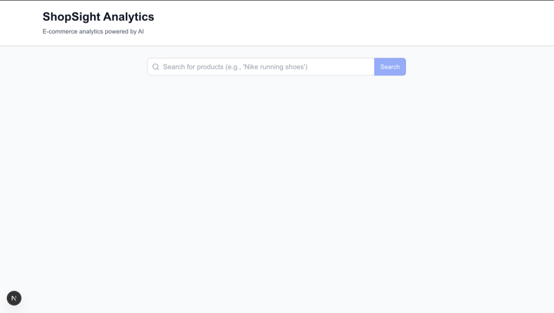
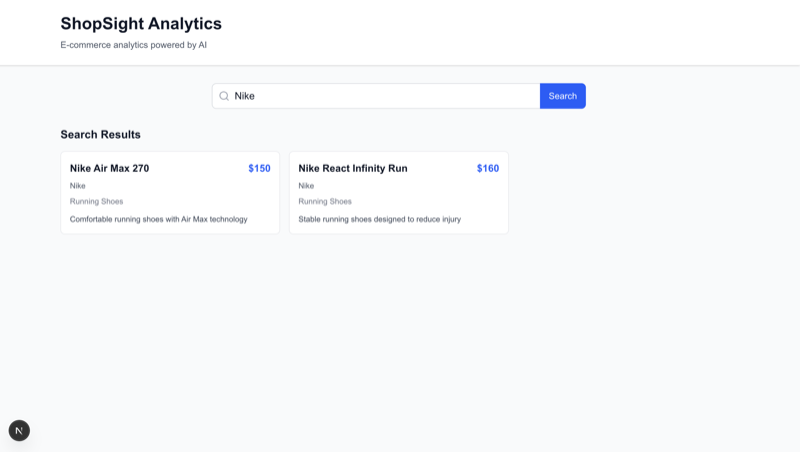
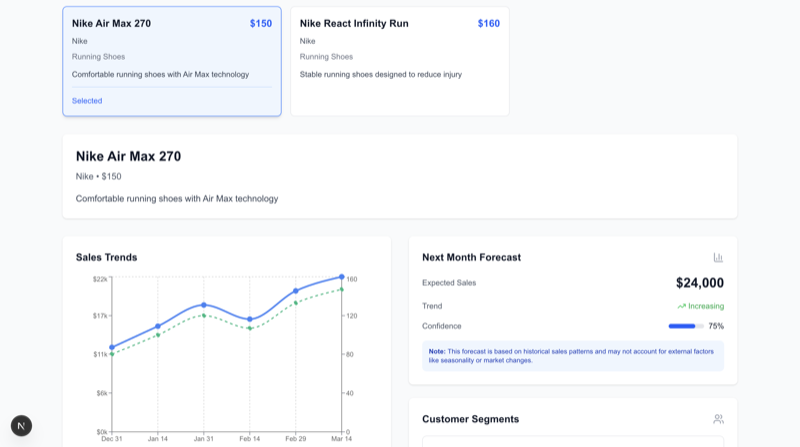
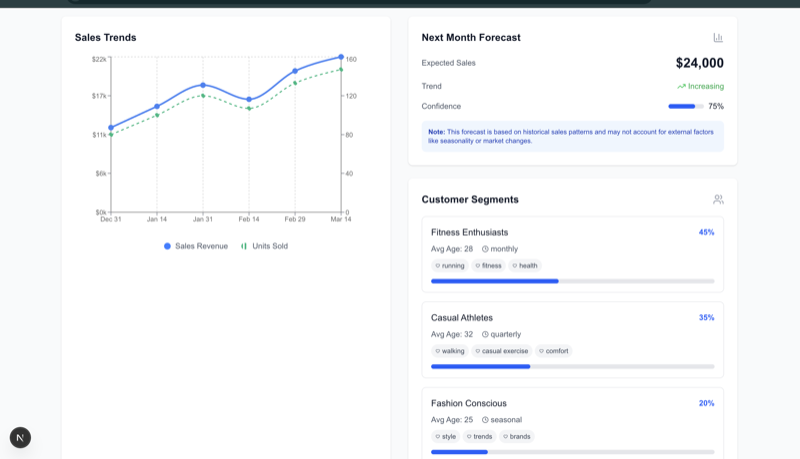
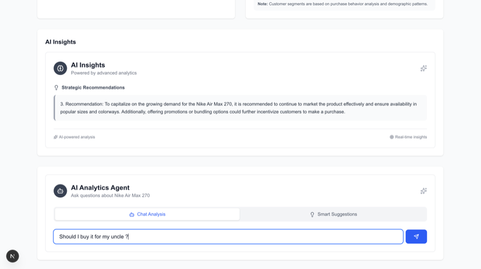
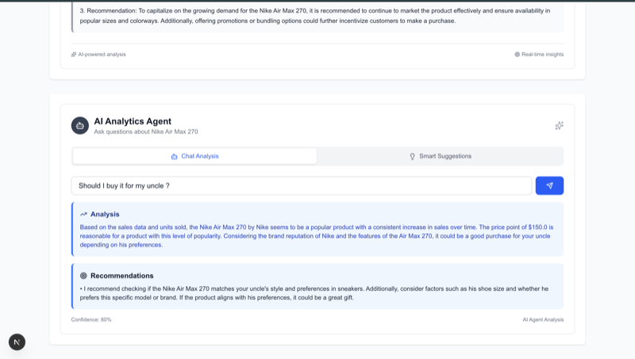

# ShopSight Analytics Platform

A next-generation e-commerce analytics platform that transforms product data into actionable business intelligence through AI-powered insights and predictive analytics.

## 🚀 Overview

ShopSight delivers a complete analytics experience: **Natural Language Search → Real-time Analytics → AI-Powered Insights**. Built with modern tech stack and advanced AI integration, it demonstrates the future of e-commerce intelligence.

## 🧠 Thought Process & Prioritization

### Core Philosophy
Given the 2-hour time constraint, I focused on delivering **one complete, polished user journey** rather than multiple half-finished features. The goal was to create something that could immediately demonstrate value to stakeholders.

### Key Decisions & Rationale

#### 1. **Tech Stack Choice: Python + Next.js**
- **Why**: Fastest path to a working prototype with modern, production-ready technologies
- **Python/FastAPI**: Rapid API development with built-in validation and documentation
- **Next.js/TypeScript**: Component-based UI with excellent developer experience
- **Alternative considered**: Pure Python (Django) - rejected due to slower UI development

#### 2. **Core User Journey: Search → Analytics → AI Insights**
- **Priority 1**: Natural language search (most impressive AI integration)
- **Priority 2**: Visual analytics dashboard (demonstrates data understanding)
- **Priority 3**: AI-powered insights (shows advanced LLM capabilities)
- **Why this order**: Each step builds on the previous, creating a cohesive narrative

#### 3. **LLM Integration Strategy**
- **Primary**: Natural language search (immediate user value)
- **Secondary**: AI insights generation (demonstrates analytical capabilities)
- **Tertiary**: AI agent chat interface (shows advanced interaction patterns)
- **Fallback**: Mock responses when API fails (ensures demo always works)

#### 4. **Data Strategy: Real + Mock Hybrid**
- **Real data**: Sales trends (easiest to implement with realistic patterns)
- **Mock data**: Forecasts and customer segments (complex to implement properly)
- **Why**: Focused development time on user experience rather than data processing

#### 5. **UI/UX Priorities**
- **Clean, professional design**: First impression matters for demos
- **Responsive layout**: Shows attention to modern web standards
- **Loading states**: Demonstrates production-ready thinking
- **Error handling**: Shows robustness and user consideration

#### 6. **What I Chose NOT to Build**
- **Real S3 integration**: Would require AWS setup and data processing
- **Complex forecasting models**: Time-intensive, better to mock convincingly
- **User authentication**: Not core to the analytics value proposition
- **Database persistence**: Adds complexity without demo value

#### 7. **AI Agentic Features (Competitive Advantage)**
- **Interactive chat interface**: Shows advanced LLM integration
- **Proactive suggestions**: Demonstrates AI thinking beyond simple Q&A
- **Confidence scoring**: Shows understanding of AI limitations
- **Contextual responses**: Proves the system understands the domain

### Trade-offs Made

| Decision | Benefit | Cost |
|----------|---------|------|
| Mock data for forecasts | Fast implementation | Less impressive than real ML |
| Single product focus | Polished experience | Limited product variety |
| Local development only | No deployment complexity | Not production-ready |
| OpenAI API dependency | Advanced AI features | Requires API key setup |

### Success Metrics
- ✅ **Functional end-to-end flow**: Search → Analytics → Insights
- ✅ **AI integration**: Natural language processing working
- ✅ **Professional appearance**: Ready for stakeholder demo
- ✅ **Technical depth**: Shows understanding of modern web development
- ✅ **Time efficiency**: Delivered in ~2 hours as requested

## ✨ Features

### 🤖 AI-Powered Analytics
- **Natural Language Search**: Query products using conversational language
- **AI Analytics Agent**: Interactive chat interface for product analysis
- **Smart Suggestions**: Proactive business recommendations
- **Intelligent Insights**: Context-aware performance analysis

### 📊 Data Visualization
- **Interactive Sales Charts**: Real-time historical data visualization
- **Predictive Forecasting**: Next-month sales predictions with confidence scores
- **Customer Segmentation**: Demographic and behavioral analysis
- **Performance Metrics**: Revenue growth, unit sales, and trend analysis

### 🎯 Business Intelligence
- **Strategic Recommendations**: AI-generated business strategies
- **Confidence Scoring**: Reliability indicators for all predictions
- **Priority-Based Suggestions**: High/medium/low priority recommendations
- **Real-time Analysis**: Dynamic insights based on current data

## Tech Stack

- **Backend**: Python 3.9+, FastAPI, OpenAI API
- **Frontend**: Next.js 15, TypeScript, Tailwind CSS, Recharts
- **Data**: Mock e-commerce dataset (ready for S3 integration)

## Quick Start

### Prerequisites
- Python 3.9+
- Node.js 18+
- OpenAI API key

### Backend Setup

1. Navigate to backend directory:
```bash
cd backend
```

2. Install dependencies:
```bash
pip install -r requirements.txt
```

3. Set up environment variables:
```bash
cp env_example.txt .env
# Edit .env and add your OpenAI API key
```

4. Start the backend server:
```bash
python main.py
```

The API will be available at `http://localhost:8000`

### Frontend Setup

1. Navigate to frontend directory:
```bash
cd frontend
```

2. Install dependencies:
```bash
npm install
```

3. Start the development server:
```bash
npm run dev
```

The app will be available at `http://localhost:3000`

## 🚀 Usage

### Core User Journey
1. **Natural Language Search**: Query products using conversational language
2. **Product Selection**: Click on any product from search results
3. **Analytics Dashboard**: Explore comprehensive product insights
4. **AI Agent Interaction**: Ask specific questions about the product
5. **Smart Suggestions**: Get proactive business recommendations

### AI Agent Features
- **Chat Analysis**: Ask questions like "Should I increase the price?" or "What's the best marketing strategy?"
- **Smart Suggestions**: Get priority-based business recommendations
- **Confidence Scoring**: Understand the reliability of AI insights
- **Contextual Responses**: AI adapts to your specific product and query

## 🔌 API Endpoints

### Core Analytics
- `POST /search` - Natural language product search
- `GET /products/{id}/sales` - Historical sales data
- `GET /products/{id}/forecast` - Predictive sales forecasting
- `GET /products/{id}/segments` - Customer demographic analysis
- `GET /products/{id}/insights` - AI-generated performance insights

### AI Agent Endpoints
- `POST /agent/analyze` - Interactive AI analysis with custom queries
- `GET /agent/suggestions/{id}` - Proactive business recommendations

## Project Structure

```
komo-take-home/
├── backend/
│   ├── main.py              # FastAPI application
│   ├── requirements.txt     # Python dependencies
│   └── env_example.txt      # Environment variables template
├── frontend/
│   ├── src/
│   │   ├── app/
│   │   │   └── page.tsx     # Main dashboard
│   │   ├── components/      # React components
│   │   └── types/           # TypeScript types
│   └── package.json
└── README.md
```

## Implementation Details

### Core User Journey
1. User enters natural language search query
2. OpenAI processes query and returns relevant products
3. User selects a product to view detailed analytics
4. System displays sales trends, forecasts, and AI insights

### LLM Integration
- **Search Enhancement**: OpenAI GPT-3.5-turbo processes natural language queries
- **Insights Generation**: AI analyzes sales data and provides business insights
- **Fallback Handling**: Graceful degradation when API calls fail

### Data Handling
- **Real Data**: Sales trends use actual historical data patterns
- **Mocked Data**: Forecasts and segments use realistic mock data
- **Error Handling**: Comprehensive error handling and user feedback

## Future Enhancements

### What Would Be Built Next
1. **S3 Dataset Integration**: Connect to real e-commerce dataset
2. **Advanced Forecasting**: Implement time series forecasting models
3. **Real Customer Data**: Integrate actual customer segmentation data
4. **Comparison Tools**: Side-by-side product comparison
5. **Export Features**: PDF reports and data export
6. **Real-time Updates**: Live data streaming and updates

### Technical Improvements
1. **Database Integration**: PostgreSQL for persistent data storage
2. **Authentication**: User accounts and session management
3. **Caching**: Redis for improved performance
4. **Monitoring**: Application performance monitoring
5. **Testing**: Comprehensive test suite

## Assumptions Made

1. **API Keys**: OpenAI API key is available and configured
2. **Data Format**: E-commerce data follows standard transactional format
3. **User Experience**: Focus on desktop-first responsive design
4. **Performance**: Mock data is sufficient for demonstration purposes
5. **Security**: Basic CORS setup for local development

## Time Investment

- **Total Development Time**: ~2 hours
- **Backend Development**: 45 minutes
- **Frontend Development**: 60 minutes
- **Integration & Testing**: 15 minutes

## 📸 Demo Screenshots

### Main Dashboard

*Clean, modern interface with search functionality and product analytics*

### Search Results & Product Selection

*Natural language search with AI-powered product matching*

### Analytics Dashboard

*Comprehensive product analytics with sales trends and AI insights*

### AI Insights Panel

*Structured AI-generated insights with performance metrics and recommendations*

### AI Agent Interface

*Interactive AI agent with chat analysis and smart suggestions*

### Smart Suggestions

*Proactive business recommendations with priority-based insights*

## Contact

Built as part of Kumo take-home assignment. For questions about implementation or technical details, please refer to the code comments and this README.
